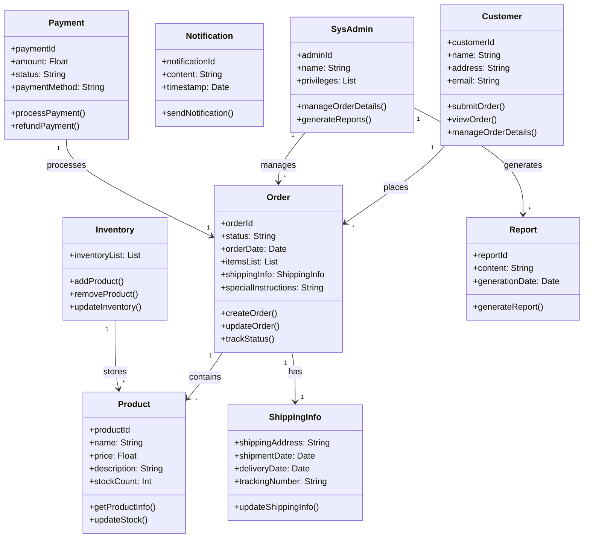

## SRS Input

### Order Processing: User Requirements

 2.1. Customers shall be able to submit new orders through the system.

 2.2. Users shall be able to view and manage order details, including items, quantities, and shipping information.

### System Requirements

- **2.1.1. User Interface Requirement**: The system shall provide an intuitive interface for customers to select items, specify quantities, enter shipping information, and confirm orders.
- **2.1.2. Integration Requirement**: The system shall integrate with the product catalog to display up-to-date information on product availability, prices, and descriptions.
- **2.1.3. Validation Requirement**: The system shall perform validation checks on order details to ensure accuracy and completeness.
- **2.1.4. Security Requirement**: The system shall ensure secure transmission of customer information during the order process.

- **2.2.1. View Order Details Requirement**: The system shall provide authorized users with the ability to view detailed information about orders, including items, quantities, prices, and shipping information.
- **2.2.2. Edit Order Details Requirement**: The system shall provide authorized users with the ability to modify order details, subject to constraints such as order status and inventory availability.
- **2.2.3. Access Control Requirement**: The system shall implement access controls to ensure that only authorized users can view or manage specific order details.

### Use-case diagram

### Class Diagram
